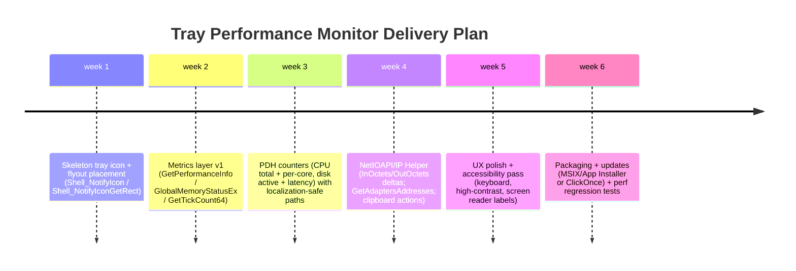

# Building a Windows 10/11 Taskbar-Tray System Monitor with Real-Time Metrics and Five-Minute Sparklines

## Executive summary

A Windows “tray app” that behaves like a compact taskbar widget is best implemented as a standard **Win32 desktop application** that places an icon in the **notification area** and shows a lightweight **flyout (popup) window** on click. Microsoft’s shell APIs for the notification area are mature and explicitly support adding/modifying/removing icons via `Shell_NotifyIcon`, and locating the icon onscreen via `Shell_NotifyIconGetRect` for precise flyout placement. citeturn0search8turn8search0turn8search3

For system metrics, the most robust approach on Windows 10/11 is a hybrid:

- **CPU / disk “utilization/latency”**: use **Performance Counters** through **PDH (Performance Data Helper)** because PDH is a high-level API designed to consume Windows counters and handles sampling/formatting across counter provider versions. citeturn5search8turn5search15turn5search2turn5search18  
- **Memory totals / committed vs cached**: use `GlobalMemoryStatusEx` + `GetPerformanceInfo` (`PERFORMANCE_INFORMATION`) to get **physical totals**, **system commit**, and **system cache** in a way that maps cleanly to “committed vs cached” requirements. citeturn17search0turn17search1turn11view0turn12view0  
- **Network throughput + IPv4/IPv6 addresses**: use **IP Helper / NetIOAPI** tables (`GetIfTable2` / `GetIfEntry2`, `MIB_IF_ROW2`) for byte counters and link speeds, and `GetAdaptersAddresses` for IPv4/IPv6 addresses. These are first-party APIs for enumerating interfaces and addresses. Make sure the code can identify the primary active network adapter and only display statistics for that one.citeturn7search25turn10view0turn1search3turn1search7  
- **Page file size**: query **WMI** `Win32_PageFileUsage` (startup + infrequent refresh) to obtain page file size/usage without trying to infer it from commit limit alone. citeturn6search2  
- **Uptime**: use `GetTickCount64` and divide by 1000 for seconds. citeturn3search0turn2search11  

For UI, a pragmatic “fast-to-build / easy-to-ship” stack is:

- **C# + modern .NET (Windows-only)**, with **WPF** for a crisp flyout, plus **CsWin32** source generation for clean Win32/PDH/IP Helper interop. CsWin32 is Microsoft’s source generator for Win32 P/Invokes. citeturn15search0turn15search2turn15search18  
- If you must match Windows 11 Fluent visuals more closely, use **WinUI 3 (Windows App SDK)** for the flyout UI, but note that WinUI 3 still lacks built-in tray icon APIs; you typically call `Shell_NotifyIcon` via Win32 interop. - We must integrage with the taskbar like the weather app. citeturn15search1turn14search4turn14search1  

Finally, plan for production hardening: counter localization (use `PdhAddEnglishCounter` to avoid localized counter name pitfalls), DPI/scale correctness, a strict sampling budget to keep CPU usage negligible, and privacy-by-design (never transmit IPs or interface metadata unless explicit). citeturn5search0turn3search31turn8search2  

## Recommended tech stack and architecture

### Recommended baseline stack

**Language/runtime**
- **C# on modern .NET (Windows desktop)** for development velocity, rich UI tooling, and straightforward interop. (If you choose to use the .NET `PerformanceCounter` API, it is delivered as a package that “interact[s] with the Windows performance counters,” but it remains Windows-specific in nature.) citeturn6search1turn6search0  

**UI framework**
- **WPF** for the flyout because it supports high-quality vector rendering, templating for sparklines, and built-in accessibility patterns (UI Automation peers). Microsoft’s accessibility guidance emphasizes UI Automation integration as a key platform component for Windows apps. citeturn3search3turn3search19  
- For Windows 11 “look,” **WinUI 3** is Microsoft’s modern UI framework in the Windows App SDK and supports Windows 10 (1809+) and Windows 11. However, WinUI 3 does not provide a first-party tray icon abstraction today; tray icon scenarios still generally rely on Win32 `Shell_NotifyIcon`. citeturn15search1turn14search4turn14search1  

**Win32 interop**
- **CsWin32** (Microsoft.Windows.CsWin32) to generate P/Invoke bindings to PDH, Shell, PSAPI, NetIOAPI, IPHLPAPI, etc., reducing manual interop risk. citeturn15search0turn15search2turn15search18  

### Architecture overview

A clean separation between **collection**, **aggregation**, and **presentation** makes it easier to test and to keep UI responsive.

```mermaid
flowchart TB
  subgraph OS[Windows 10/11]
    PDH[Performance Counters via PDH]
    PSAPI[GetPerformanceInfo / GlobalMemoryStatusEx]
    IPH[IP Helper / NetIOAPI / GetAdaptersAddresses]
    WMI[WMI Win32_PageFileUsage]
    SHELL[Shell_NotifyIcon / Shell_NotifyIconGetRect]
  end

  subgraph App[Tray Monitor App]
    Sampler[Sampler Service\n(1s tick, jitter-controlled)]
    Store[Rolling Store\n(ring buffers per metric)]
    Model[ViewModel\n(computed display values)]
    UI[Tray Flyout UI\n(WPF or WinUI 3)]
    Tray[Tray Icon Host\n(Win32 notify icon)]
  end

  PDH --> Sampler
  PSAPI --> Sampler
  IPH --> Sampler
  WMI --> Sampler
  Sampler --> Store --> Model --> UI
  SHELL --> Tray --> UI
```

Key design intent:
- **Sampling happens off the UI thread** and publishes immutable snapshots to the UI at a controlled rate (e.g., 4–10 FPS UI refresh, 1 Hz data sampling).
- **Ring buffers** store exactly the last 5 minutes (e.g., 300 points at 1-second resolution).
- **Flyout placement** uses the tray icon’s bounding rectangle, which the shell can provide. citeturn8search0turn8search12  

## Data acquisition strategy and required Windows metrics

This section maps each required metric to a recommended API and explains why, with an emphasis on official Microsoft APIs.

### Performance counters via PDH for CPU and disk

**Why PDH**
Microsoft documents PDH as a high-level API that is “easier to use than the registry functions” for consuming Windows performance counter data and can access both V1 and V2 providers. citeturn0search25turn5search8  

**PDH collection model**
A PDH “query” is opened with `PdhOpenQuery`, counters are attached with `PdhAddCounter` (or `PdhAddEnglishCounter`), and you call `PdhCollectQueryData` repeatedly to collect samples. Microsoft notes PDH stores raw values for the current and previous collection, and formatted values are computed with `PdhGetFormattedCounterValue`. citeturn0search1turn5search1turn0search33turn5search2  
If you prefer PDH to manage timing, `PdhCollectQueryDataEx` can create a timing thread that waits and collects samples. citeturn5search24turn5search29  

**Counter localization warning**
Counter object/counter names can be localized. Microsoft provides `PdhAddEnglishCounter` specifically to add “language-neutral” (English) counters and then obtain localized paths as needed. This is the safest choice if you plan to run on non–en-US Windows installations. citeturn5search0turn5search10  

**CPU % (total + per-core)**
- Windows performance counters are referenced as: `[Object]\<Instance>\<Counter Name>`. citeturn13view0  
- Microsoft explicitly documents that `\Processor(_Total)\% Processor Time` is the **average usage of all processors**. citeturn1search1  

Recommended approach:
- Use PDH with wildcards and expansion so you don’t hardcode instance naming conventions (which can vary between “Processor” vs “Processor Information” provider sets across versions/editions).
- Collect:
  - Total CPU: `\Processor(_Total)\% Processor Time` (fallback) citeturn1search1turn1search13  
  - Per-core CPU: prefer `\Processor Information(*)\% Processor Time` (commonly used in modern troubleshooting guidance), with wildcard expansion. citeturn13view0turn13view1  

**Disk % active time and average response time**
Microsoft’s scenario guidance for PerfMon identifies key storage latency counters such as:
- `\LogicalDisk(*)\Avg. Disk sec/Read`, `\LogicalDisk(*)\Avg. Disk sec/Write`
- `\PhysicalDisk(*)\Avg. Disk sec/Read`, `\PhysicalDisk(*)\Avg. Disk sec/Write` citeturn13view0  

For your “average response time,” those `Avg. Disk sec/*` counters are the most direct mapping.

For your “disk % active time,” common practice is to use `% Disk Time` counters from `PhysicalDisk` or `LogicalDisk`. Because exact counter availability can differ by configuration, you should **validate installed counters** using built-in tooling (e.g., `typeperf -qx PhysicalDisk` enumerates counters for an object). citeturn1search25turn13view0  

### Memory totals, committed vs cached

Microsoft summarizes that memory performance information is available through system performance counters and functions including `GetPerformanceInfo` and `GlobalMemoryStatusEx`. citeturn17search11turn0search14  

**Total physical memory**
- `GlobalMemoryStatusEx` retrieves “current usage of both physical and virtual memory.” citeturn17search0turn12view0  
- `MEMORYSTATUSEX.ullTotalPhys` is “the amount of actual physical memory” (bytes). citeturn12view0  

**Committed memory (committed vs limit)**
- `GetPerformanceInfo` retrieves `PERFORMANCE_INFORMATION`. citeturn17search1turn11view0  
- `PERFORMANCE_INFORMATION.CommitTotal` is the number of pages currently committed by the system; `CommitLimit` is the max pages that can be committed without extending paging files (and is a soft limit if pagefiles can grow). citeturn11view0  

You can compute:
- `CommittedBytes = CommitTotal * PageSize`
- `CommitLimitBytes = CommitLimit * PageSize`
- `CommitPercent = CommittedBytes / CommitLimitBytes`

**Cached memory**
- `PERFORMANCE_INFORMATION.SystemCache` is “the amount of system cache memory” (pages), described as “the standby list plus the system working set.” citeturn11view0  
This provides a defensible “cached memory” reading for a compact monitor UI.

### Page file size

`GlobalMemoryStatusEx` exposes “committed memory limit” fields (e.g., `ullTotalPageFile`) but Microsoft notes that to get the **system-wide** committed memory limit you should call `GetPerformanceInfo`. citeturn12view0turn17search1  
However, neither is a clean “page file size” because commit limit blends RAM + pagefile capacity and can shift.

For explicit page file sizing, use WMI:
- `Win32_PageFileUsage` represents the page file and provides runtime state (including size/usage properties). citeturn6search2  

Design recommendation: call WMI at startup and then infrequently (e.g., every 60–300 seconds, or on demand in the flyout) because WMI is not optimized for high-frequency polling.

### Disk total size

For disk capacity, use file system APIs:
- `GetDiskFreeSpaceEx` “retrieves information about the amount of space that is available on a disk volume,” including total space and free space. citeturn1search2turn1search22  

Implementation choice:
- If your “Disk” is meant to represent the system drive, call `GetDiskFreeSpaceEx("C:\\")` (or resolve the system directory drive).
- If you want “total disk size” across fixed volumes, iterate mounted fixed drives and sum `totalBytes`.

### Network throughput, link speeds, and IP addresses

**Throughput (Up/Down speeds)**
Use NetIOAPI / IP Helper interface counters:
- `GetIfTable2` enumerates logical and physical interfaces and returns `MIB_IF_TABLE2` containing rows of `MIB_IF_ROW2`. citeturn7search25turn7search1  
- `MIB_IF_ROW2` includes `InOctets` and `OutOctets` (total bytes received/sent), as well as `TransmitLinkSpeed` and `ReceiveLinkSpeed` (bits per second). citeturn10view0  
- Tables allocated by these APIs should be freed with `FreeMibTable`. citeturn7search2turn7search5  

Compute Kbps:
- Sample `InOctets`, `OutOctets` at time `t1`, then again at `t2`.
- `down_bps = (InOctets2 - InOctets1) * 8 / (t2 - t1)`
- `down_kbps = down_bps / 1000` (be explicit whether you mean decimal Kbps (1000) or Kibps (1024)).

**Selecting the “active” interface**
On multi-interface systems (VPN, Docker, Wi-Fi + Ethernet), you typically want the interface used for the default route. Microsoft provides:
- `GetBestInterfaceEx`, which “retrieves the index of the interface that has the best route to the specified IPv4 or IPv6 address.” citeturn16search0  
Microsoft even documents that BITS uses `GetBestInterfaceEx` when multiple interfaces exist, to determine the best route to a specified address. citeturn16search28  

A practical approach is to call `GetBestInterfaceEx` with a well-known destination (for example, a public IP like 1.1.1.1 or a DNS resolver), then monitor that interface index. (If you do not want to “bake in” an external IP, you can use routing table APIs such as `GetBestRoute2`, but that is more complex.) citeturn16search1turn16search0  

**IPv4 + IPv6 addresses**
- `GetAdaptersAddresses` “can retrieve information for IPv4 and IPv6 addresses” and returns a linked list of `IP_ADAPTER_ADDRESSES` structures. citeturn1search3turn1search7  

For display:
- Collect unicast addresses for the selected adapter/interface, filter out temporary/duplicate addresses if desired, and display both IPv4 and IPv6 (truncate IPv6 with ellipsis in the UI but copy full value to clipboard).

### Uptime in seconds

- `GetTickCount64` returns milliseconds elapsed since the system started. citeturn3search0turn2search11  
Compute uptime seconds as `GetTickCount64() / 1000`.

### Processor counts and “virtual processors”

**Definitions**
Microsoft’s processor-groups documentation defines:
- A **logical processor** as a logical compute engine from the OS perspective.
- A **core** as a processor unit that can contain one or more logical processors.
- A **physical processor** (package/socket) can contain one or more cores. citeturn2search28  

**Counts**
- `GetActiveProcessorCount(ALL_PROCESSOR_GROUPS)` returns the number of active processors in the system (across all groups), which is the safest way to obtain total logical processors on machines with processor groups. citeturn2search0turn2search4turn2search22  
- For topology, `GetLogicalProcessorInformationEx(RelationProcessorCore, ...)` returns a `PROCESSOR_RELATIONSHIP` entry for every active processor core in every processor group. citeturn2search5turn2search13  

For your UI, interpret “virtual processors” as **logical processors visible to the OS** and report:
- LogicalProcessors = `GetActiveProcessorCount(ALL_PROCESSOR_GROUPS)`
- Cores = count of `RelationProcessorCore` structures returned by `GetLogicalProcessorInformationEx`

## Candidate APIs and libraries comparison

The table below compares the most relevant options for each metric category, focusing on Windows 10/11 desktop.

| Option | Category | Pros | Cons / Risks | Recommended use |
|---|---|---|---|---|
| **PDH (Performance Data Helper)** (`PdhOpenQuery`, `PdhAddCounter`, `PdhCollectQueryData`, `PdhGetFormattedCounterValue`) | CPU/Disk (and many others) | First-party high-level counter consumer; easier than registry perf APIs; supports V1 & V2 providers; designed for real-time and logs. citeturn0search25turn5search15turn0search33turn5search2 | Must manage query/counter handles; some counters need multiple samples; counter paths can be localized. citeturn0search33turn5search0 | **Primary choice** for CPU % (total/per-core) and disk utilization/latency counters. |
| **`PdhAddEnglishCounter`** | PDH usability | Avoids localized counter name pitfalls by using language-neutral counter strings. citeturn5search0turn5search10 | Still need wildcard expansion + instance handling; not available on very old Windows (not relevant for Win10/11). citeturn5search23 | **Use by default** to reduce localization issues. |
| **.NET `System.Diagnostics.PerformanceCounter`** (NuGet `System.Diagnostics.PerformanceCounter`) | Managed wrapper for performance counters | Easy in C#; integrates with .NET; widely used; package explicitly supports interacting with Windows performance counters. citeturn6search1turn6search0 | Category/instance naming issues still apply; may require careful warm-up (many counter types are calculated from samples). citeturn6search8turn1search1 | Good for prototypes; PDH often preferable for production-grade localization + control. |
| **WMI** (`System.Management`, classes like `Win32_PageFileUsage`) | Page file size + some system inventory | Provides page file details directly; Microsoft documents `Win32_PageFileUsage` as the page file WMI class. citeturn6search2turn6search10 | Heavier and slower than PDH/IP Helper for high-frequency polling; complexity of COM/WMI error handling. | Use **sparingly**: pagefile size on startup + occasional refresh. |
| **PSAPI** `GetPerformanceInfo` / `PERFORMANCE_INFORMATION` | Memory (commit + cache) | First-party; provides commit totals/limits and `SystemCache` in pages; clean mapping to “committed vs cached.” citeturn17search1turn11view0 | Returns pages (need page-size conversion); not a full replacement for all “Memory\*” perf counters. | **Primary choice** for committed vs cached metrics. |
| **Kernel32** `GlobalMemoryStatusEx` / `MEMORYSTATUSEX` | Memory totals | Straightforward totals/available; Microsoft warns older `GlobalMemoryStatus` can be incorrect and recommends `GlobalMemoryStatusEx`. citeturn17search0turn17search3turn12view0 | `ullTotalPageFile` is a commit limit concept and not a “pagefile size” per se. citeturn12view0 | Use for **total/available physical** and overall memory load. |
| **NetIOAPI / IP Helper** (`GetIfTable2`, `GetIfEntry2`, `MIB_IF_ROW2`) | Network throughput & link speeds | First-party, lightweight; provides octet counters and link speeds; includes both logical and physical interfaces; requires `FreeMibTable`. citeturn7search25turn10view0turn7search2 | Must choose which interface to display; counters are cumulative so you must compute deltas; handle wrap/availability. | **Primary choice** for up/down Kbps and link speed display. |
| **IP Helper** `GetAdaptersAddresses` | IPv4/IPv6 addresses | First-party; explicitly supports IPv4 and IPv6; returns linked list of adapter address structures. citeturn1search3turn1search19 | Enumerating and filtering addresses correctly takes care (temporary/virtual/VPN). | **Primary choice** for address enumeration. |
| **Shell** `Shell_NotifyIcon`, `NOTIFYICONDATA`, `Shell_NotifyIconGetRect` | Tray icon + positioning | First-party shell API; explicitly for notification area; can locate icon rectangle for flyout positioning. citeturn0search8turn0search4turn8search0 | Requires a message loop + window procedure; must handle explorer restarts. | **Primary choice** for tray icon host and flyout placement. |
| **Windows App SDK / WinUI 3** | Modern UI | Microsoft’s modern UI framework; Fluent design; Windows 10/11 support. citeturn15search1 | Tray icon support still typically via Win32 interop rather than built-in SDK abstraction. citeturn14search4turn14search1 | Use if you want Fluent; otherwise WPF is simpler for tray utilities. |

## Sampling, rolling storage, and sparkline rendering

### Sampling cadence and five-minute window

A five-minute sparkline implies a rolling window of **300 seconds**. A good default is **1 sample per second**:
- 5 minutes × 60 seconds = **300 points** per metric.
- 4 metrics → 1200 points—small enough to keep fully in memory and redraw quickly.

If you want to reduce CPU usage further, sample at **2 seconds (150 points)** or **5 seconds (60 points)** and interpolate for rendering. (The scenario guide for Performance Monitor notes that 1-second sampling can create high-density data where tooling starts summarizing points for display; your app can avoid this by storing raw 1 Hz points and drawing directly without summarization.) citeturn13view0  

### Rolling data structure (ring buffer)

Use a fixed-capacity ring buffer per sparkline. Each update overwrites the oldest sample.

**Data model (conceptual)**  
- `MetricSample { DateTimeOffset t; float value; }`
- `RingBuffer<MetricSample>(capacity = 300)`

You may also keep a “display snapshot” computed from raw samples (min/max/last) to reduce UI logic.

### Rendering sparklines in a compact flyout

In a tray flyout, space is tight. The most readable approach is a **small row per metric**:

- Left: label (“CPU”, “Mem”, “Disk”, “Net”)
- Middle: sparkline (five minutes)
- Right: current value (e.g., `37%`, `9.2/31.8 GB`, `12%`, `↓ 820 Kbps ↑ 140 Kbps`)

**Scale strategy**
- For percent metrics (CPU, Disk Active), clamp to [0, 100].
- For throughput (Kbps), auto-scale to the rolling max (or P95) in the last five minutes so bursts do not flatten the chart. Consider a minimum scale floor (e.g., 100 Kbps) so “near zero” doesn’t look like noise.

**Smoothing**
Avoid heavy smoothing because it can mislead. A simple 3-point moving average is enough for visual stability; always show the current numeric value separately.

## Tray UX patterns, accessibility, and clipboard actions

### Notification area behaviors and flyout positioning

The notification area exists to provide status + notifications; tray icons are created and managed using `Shell_NotifyIcon`. citeturn8search3turn0search8  
To position your flyout near the tray icon, `Shell_NotifyIconGetRect` can return screen coordinates of the icon’s bounding rectangle (Windows 7+). citeturn8search0turn8search12  

Practical UX pattern:
- **Left click**: toggle the flyout open/closed.
- **Right click**: show context menu (Start on login, refresh rate, select NIC/disk, exit).
- **Hover**: tooltip with one-line summary (CPU, Mem, Disk, Net).
- **Esc**: closes flyout and returns focus to notification area (Shell supports returning focus with `NIM_SETFOCUS` via `Shell_NotifyIcon`). citeturn0search8  

### Accessibility and inclusive design essentials

For accessibility, rely on standard controls where possible because they integrate with **Microsoft UI Automation**; Microsoft describes accessibility support as coming primarily from integrated UI Automation support and automation peers/patterns for controls. citeturn3search3turn3search19  

Checklist highlights for a tray flyout:
- Ensure text contrast is sufficient; Microsoft’s accessibility checklist recommends verifying contrast (commonly 4.5:1) and validating high-contrast theme behavior. citeturn3search31turn3search27  
- Provide keyboard navigation: tab order through metric rows and buttons.
- Ensure sparklines are not the only carrier of information; always include numeric values (important for color-blind and screen-reader users). citeturn3search31  
- DPI scaling: WPF is system-DPI aware by default; if you want per-monitor DPI behavior, follow Microsoft’s guidance for DPI-aware WPF apps. citeturn8search2  

### Clipboard button for IPv4/IPv6 addresses

For managed apps, `System.Windows.Clipboard.SetText` stores Unicode text on the clipboard. citeturn3search2  
Microsoft also reminds that the clipboard is shared across applications and includes security considerations (for example, paste operations should be user-initiated). citeturn3search30  

UX recommendation:
- Show truncated IPv6 in the UI, but copy the full address.
- Provide two buttons: **Copy IPv4**, **Copy IPv6**, plus a combined **Copy all** (IPv4 + IPv6 + interface name) for support workflows.

## Implementation blueprint: code/pseudocode, project structure, testing, and deployment

### Key code snippets and pseudocode

Below are illustrative snippets (not drop-in complete) showing the main tasks. They assume a C# + WPF app using CsWin32-generated bindings where possible.

#### PDH counter setup and sampling (CPU/disk)

```csharp
// Pseudocode / illustrative C#
class PdhMetricReader : IDisposable
{
    private PDH_HQUERY _query;
    private readonly Dictionary<string, PDH_HCOUNTER> _counters = new();

    public void Initialize()
    {
        // Create query (PdhOpenQuery). citeturn5search15
        PdhOpenQuery(null, IntPtr.Zero, out _query);

        // Use language-neutral counters to avoid localization problems. citeturn5search0
        AddEnglishCounter(@"\Processor(_Total)\% Processor Time", "cpu.total");

        // Example disk counters (validate availability via typeperf -qx). citeturn1search25turn13view0
        AddEnglishCounter(@"\PhysicalDisk(_Total)\% Disk Time", "disk.activePct");
        AddEnglishCounter(@"\PhysicalDisk(_Total)\Avg. Disk sec/Read",  "disk.latRead");
        AddEnglishCounter(@"\PhysicalDisk(_Total)\Avg. Disk sec/Write", "disk.latWrite");
    }

    private void AddEnglishCounter(string path, string key)
    {
        PdhAddEnglishCounter(_query, path, IntPtr.Zero, out var counter); // citeturn5search0
        _counters[key] = counter;
    }

    public void CollectSample()
    {
        // Collect raw samples; PDH stores current + previous internally. citeturn0search33
        PdhCollectQueryData(_query);
    }

    public float ReadFloat(string key)
    {
        // Compute displayable value (PdhGetFormattedCounterValue). citeturn5search2turn5search18
        PdhGetFormattedCounterValue(_counters[key], PDH_FMT_DOUBLE, out _, out var val);
        return (float)val.doubleValue;
    }

    public void Dispose() { /* PdhCloseQuery + cleanup */ }
}
```

Notes:
- Many counters require at least **two collections** to compute percentages/interval rates correctly. This is consistent with the general design of calculated counters (they are derived from multiple samples). citeturn6search8turn0search33  
- If you are using wildcard instances (per-core CPU), use PDH wildcard expansion and enumerate instances rather than hardcoding names. Query-creation guidance calls out using counter paths with wildcards and expanding them to matching counters. citeturn5search22turn5search3  

#### Memory metrics (total, committed, cached)

```csharp
// Illustrative C#
MemorySnapshot ReadMemory()
{
    // Total/available physical via GlobalMemoryStatusEx. citeturn17search0turn12view0
    MEMORYSTATUSEX ms = new() { dwLength = (uint)Marshal.SizeOf<MEMORYSTATUSEX>() };
    GlobalMemoryStatusEx(ref ms);

    // Committed + cache via GetPerformanceInfo/PERFORMANCE_INFORMATION. citeturn17search1turn11view0
    PERFORMANCE_INFORMATION pi = new() { cb = (uint)Marshal.SizeOf<PERFORMANCE_INFORMATION>() };
    GetPerformanceInfo(ref pi, pi.cb);

    ulong pageSize = (ulong)pi.PageSize;

    return new MemorySnapshot
    {
        TotalPhysBytes = ms.ullTotalPhys,
        AvailPhysBytes = ms.ullAvailPhys,
        CommittedBytes = (ulong)pi.CommitTotal * pageSize,   // CommitTotal pages. citeturn11view0
        CommitLimitBytes = (ulong)pi.CommitLimit * pageSize, // CommitLimit pages. citeturn11view0
        CachedBytes = (ulong)pi.SystemCache * pageSize       // SystemCache pages. citeturn11view0
    };
}
```

#### Network up/down Kbps and IP addresses

```csharp
// Illustrative: compute Kbps from MIB_IF_ROW2 octet counters. citeturn10view0
class NetworkRateCalculator
{
    private ulong _prevInOctets, _prevOutOctets;
    private long _prevTicksMs;

    public void Initialize(MIB_IF_ROW2 row, long nowMs)
    {
        _prevInOctets = row.InOctets;
        _prevOutOctets = row.OutOctets;
        _prevTicksMs = nowMs;
    }

    public (double downKbps, double upKbps) Update(MIB_IF_ROW2 row, long nowMs)
    {
        long dtMs = Math.Max(1, nowMs - _prevTicksMs);
        ulong dIn = row.InOctets - _prevInOctets;
        ulong dOut = row.OutOctets - _prevOutOctets;

        _prevInOctets = row.InOctets;
        _prevOutOctets = row.OutOctets;
        _prevTicksMs = nowMs;

        double downBps = (dIn * 8.0) / (dtMs / 1000.0);
        double upBps   = (dOut * 8.0) / (dtMs / 1000.0);

        return (downBps / 1000.0, upBps / 1000.0); // Kbps (decimal)
    }
}
```

To enumerate interfaces and free resources:
- `GetIfTable2` returns `MIB_IF_TABLE2` and must be freed with `FreeMibTable`. citeturn7search25turn7search2  

To get IPv4 and IPv6 addresses:
- `GetAdaptersAddresses` returns a linked list of `IP_ADAPTER_ADDRESSES` with IPv4/IPv6 info. citeturn1search3turn1search19  

To pick the “primary” interface index:
- use `GetBestInterfaceEx`. citeturn16search0turn16search28  

#### Uptime and processor counts

```csharp
ulong uptimeSeconds = GetTickCount64() / 1000; // citeturn3search0turn2search11

// Logical processor count across groups: GetActiveProcessorCount(ALL_PROCESSOR_GROUPS). citeturn2search0turn2search22
uint logicalProcs = GetActiveProcessorCount(ALL_PROCESSOR_GROUPS);
```

#### Clipboard action (IP copy)

```csharp
// WPF example: user clicks a "Copy IPv4" button
private void CopyToClipboard(string text)
{
    // Stores Unicode text on the Clipboard. citeturn3search2
    Clipboard.SetText(text);
}
```

### Suggested project structure

A maintainable structure (single repo, multiple projects) for a tray utility:

- `TrayPerfMon.App`  
  WPF/WinUI UI, resources, localization, DI container, view models.
- `TrayPerfMon.Platform.Windows`  
  Win32 wrappers (Shell tray icon host, PDH interop, IP Helper/NetIOAPI calls, PSAPI calls). Prefer CsWin32-generated interop files. citeturn15search0turn15search2  
- `TrayPerfMon.Core`  
  Metric definitions, ring buffer, aggregation math, unit formatting, configuration model.
- `TrayPerfMon.Tests`  
  Unit tests for ring buffer behavior, scaling logic, formatting, “delta” computations, and snapshot publishing.
- `TrayPerfMon.Installer` (optional)  
  MSIX packaging project or WiX project.

### Testing checklist

Functional correctness
- CPU total correlates with Task Manager; verify that “_Total” CPU matches the expectation that it is an average across processors. citeturn1search1  
- Per-core CPU: verify number of sparkline rows equals logical processor count (and validate group behavior on >64 LP machines using `GetActiveProcessorCount`). citeturn2search0turn2search28  
- Disk latency counters display plausible values (ms) and match PerfMon’s `Avg. Disk sec/Read/Write` definitions. citeturn13view0  
- Memory:
  - Total physical matches `ullTotalPhys`. citeturn12view0  
  - Committed/limit derived from `CommitTotal`/`CommitLimit`. citeturn11view0  
  - Cached matches `SystemCache`. citeturn11view0  
- Network:
  - Throughput computed from `InOctets`/`OutOctets` deltas; verify with a known download/upload. citeturn10view0  
  - IPv4/IPv6 addresses match `ipconfig` output and come from `GetAdaptersAddresses`. citeturn1search3  

Reliability and resilience
- Explorer restart: tray icon should re-add itself if the shell restarts (common tray app requirement).
- Counter localization: validate on a non-English Windows build; confirm `PdhAddEnglishCounter` works. citeturn5search0  
- Multi-monitor + DPI scaling: test moving flyout across monitors; WPF DPI behavior should be acceptable; adopt per-monitor DPI approach if needed. citeturn8search2  

Accessibility
- High contrast theme: verify readability and correct rendering; Microsoft’s checklist recommends explicit verification. citeturn3search31turn3search27  
- Keyboard: open flyout, tab through controls, press Enter on “Copy IP,” Esc to close.
- Screen reader: confirm each metric row has a meaningful accessible name (e.g., “CPU 37 percent, last five minutes sparkline”) and the sparkline itself does not trap focus.

Performance
- Measure CPU usage of the monitor itself at idle (target well under 1% on typical machines; PerfMon logging guidance suggests properly configured collection can have very small impact). citeturn13view0  
- Ensure no allocation spikes at 1 Hz sampling (preallocate buffers; reuse objects).

### Permissions, performance impact, and security/privacy considerations

Permissions
- Most local performance counters and IP Helper queries can run as a standard user in an interactive session; avoid requiring admin privileges by not attempting privileged operations (like altering system configuration).
- If you later move sampling into a Windows Service (non-interactive session), be aware that some environments restrict performance counter visibility for non-interactive sessions (this becomes an enterprise hardening concern). (If you stick to an interactive tray utility, you typically avoid this entire class of problems.)

Performance impact controls
- Prefer lightweight OS APIs (`GetPerformanceInfo`, `GetIfEntry2`/`GetIfTable2`) and PDH queries over frequent WMI polling. citeturn17search1turn7search25turn6search2  
- Keep sampling at 1 Hz and UI refresh lower (e.g., 4–10 Hz) to reduce unnecessary redraws.
- Use one PDH query with multiple counters rather than one query per counter.

Security/privacy
- Treat IP addresses (especially public IPv6) as potentially sensitive. Show them only in the flyout and copy only on explicit user action; do not log them by default.
- If you implement telemetry, never include full IP addresses unless users opt in; store only coarse-grained metrics or hashes.
- Clipboard: the clipboard is shared across apps and its contents can change; copying should be user-initiated and you should avoid automatically exposing sensitive data. citeturn3search30  

### Deployment options and auto-update

**MSIX (recommended modern packaging)**
- Microsoft describes **MSIX** as a Windows app packaging format “built to be safe and reliable.” citeturn4search0turn4search12  
- If you distribute outside the Microsoft Store, you can use an **App Installer** file to configure update behavior; Microsoft documents “App Installer file update settings” and the “auto-update and repair” capabilities for non-Store distribution. citeturn4search1turn4search21  

**ClickOnce (simple self-updating)**
- Microsoft describes ClickOnce as a deployment technology for “self-updating Windows-based applications” with minimal user interaction. citeturn4search18turn4search2  
- ClickOnce is often operationally simpler for internal tools, but has different capabilities and constraints than MSIX.

**MSI (traditional enterprise)**
- For classic MSI installers, WiX is a common toolchain; WiX “lets developers create installers for Windows Installer.” citeturn4search3turn4search15  

A practical choice for this kind of tray utility:
- **Consumer/shareware-like distribution**: MSIX + App Installer auto-updates. citeturn4search21turn4search1  
- **Internal enterprise**: MSIX if your org supports it; otherwise MSI via WiX.
- **Internal “no-admin” installs**: ClickOnce is often attractive.

Implementation timeline sketch:



This plan aligns the “hardest-to-change” dependencies (tray shell integration + counter strategy) early, and schedules accessibility and packaging before release, consistent with Microsoft’s emphasis on validating contrast/high-contrast behavior and ensuring UI Automation-friendly control usage. citeturn3search31turn3search3turn4search21